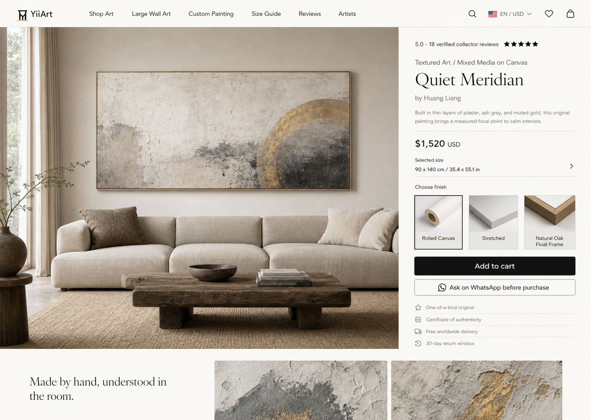

# YiiArt Room-First Product Detail Design

## Status

Approved visual direction: the second Product Design concept, with an immersive room scene on the left and a compact purchase panel on the right.

## Objective

Redesign the existing `/artwork/[slug]` experience so an international collector can understand scale, material, price, delivery confidence, and the next purchase action without leaving the first screen. The page should borrow useful ecommerce structure from the NukeArt reference while remaining recognizably YiiArt: calm, editorial, original-art focused, and free of aggressive discount mechanics.

## Success Criteria

- The first desktop viewport shows a real room-scale image, artwork identity, price, fixed size, available presentation options, a working purchase action, and a consultation action.
- Mobile keeps the artwork visible, preserves readable product information, and retains a persistent purchase action without covering content.
- Existing Sanity products, currency conversion, cart behavior, checkout validation, reviews, SEO metadata, WhatsApp links, and related artwork continue to work.
- Generated room scenes are clearly treated as visualizations; original artwork and texture-detail images remain available in the gallery.
- The page contains no copied NukeArt artwork, copy, promotion graphics, countdown, fake urgency, or fake review data.

## Scope

### In Scope

- Refactor the current 1,000-line artwork page into focused product-detail components.
- Replace the current gallery-first product card with the approved room-first hero composition.
- Add an interactive gallery that supports room scene, full artwork, texture detail, and edge or framing detail.
- Add a compact sticky purchase panel with review summary, artwork story, fixed dimensions, optional presentation choices, add-to-cart, WhatsApp advice, and trust rows.
- Add a two-image editorial strip immediately below the hero.
- Keep and visually restyle the existing artwork details, size guide, customization, process, packaging, related artworks, and review sections.
- Create an original prototype content set and image shot list for `Quiet Meridian` to validate the visual direction without overwriting live Sanity content.

### Out of Scope

- Shopify migration.
- Discount campaigns, countdowns, coupons, or first-order popups.
- Custom-size checkout or dynamically priced size variants.
- Publishing generated content into production Sanity without a separate content review.
- New checkout providers or new routes.

## Visual System

- Base surface: YiiArt warm paper `#fbfaf6`.
- Primary ink: `#181613`; supporting text: `#6f675d`; dividers: `#ded8ce`.
- Use the current YiiArt header and storefront controls.
- Use one editorial serif for artwork title and section statements, and the existing clean sans-serif for navigation, price, controls, and supporting copy.
- Prefer whitespace, alignment, and thin dividers over bordered cards and shadows.
- Desktop target: 1440 px wide. The room scene occupies roughly two-thirds of the hero; the purchase panel occupies the remaining third.
- Mobile target: single-column gallery followed by purchase content, with a persistent bottom action bar.

## Content Direction

The prototype content validates tone and hierarchy. It does not replace real product records automatically.

- Category: `Textured Art / Mixed Media on Canvas`
- Title: `Quiet Meridian`
- Artist: `Huang Liang`
- Review line: `5.0 / 5 - 18 verified collector reviews` only in preview data; production uses real review statistics and hides the row when there are no reviews.
- Price: `$1,520 USD` in preview data; production uses the existing currency and price utilities.
- Story: `Built in thin layers of plaster, ash gray, and muted gold, this original painting brings a measured focal point to calm interiors.`
- Size: `90 x 140 cm / 35.4 x 55.1 in`
- Presentation choices: `Rolled Canvas`, `Stretched`, and `Natural Oak Float Frame`.
- Primary action: `Add to cart`.
- Secondary action: `Ask on WhatsApp before purchase`.
- Trust lines: `One-of-a-kind original`, `Certificate of authenticity`, `Free worldwide delivery`, and `30-day return window`.
- Editorial statement: `Made by hand, understood in the room.`

## Image Direction

Create an original artwork rather than copying the reference product. The prototype artwork uses pale mineral plaster, subtle charcoal marks, weathered sand texture, and an off-center burnished-gold arc.

Required gallery assets:

1. Primary room scene: horizontal artwork above a low oatmeal linen sofa, warm north-window daylight, neutral plaster wall, and minimal natural materials.
2. Full artwork view: straight-on, color-accurate, neutral studio background, with the entire canvas and edges visible.
3. Texture detail: raking side light showing plaster ridges, mineral pigment, knife marks, and restrained gold material.
4. Edge or presentation detail: close view of the selected canvas or float-frame treatment.

Generated room scenes must be labeled as room visualizations in alt text or nearby supporting copy. They must never be the only visual proof of the physical artwork.

## Page Architecture

The existing server page remains responsible for fetching Sanity artwork, reviews, related works, SEO data, structured data, currency values, and availability. It passes a normalized view model into smaller components.

### `ArtworkHeroGallery`

A client component that receives normalized gallery items and manages the selected image. It renders the room scene as the initial image when one exists, then full artwork and detail images. Keyboard focus, button labels, and image alt text identify each view.

### `ArtworkPurchasePanel`

Renders artwork identity, real review summary, story, price, fixed dimensions, availability, trust information, and consultation links. It remains sticky on desktop and normal-flow on mobile.

### `ArtworkPresentationSelector`

An optional client component for same-price presentation choices configured in Sanity. It is not a custom-size or price-variant system. Products without configured choices show the existing framing note instead.

### `ArtworkPurchaseActions`

Wraps the existing add-to-cart behavior and passes the selected presentation choice into cart state. Sold, reserved, quote-only, or invalid-price products retain the existing invoice and consultation fallback.

### `ArtworkMaterialStory`

Uses two genuine detail images plus the editorial statement immediately below the hero. If fewer than two detail images exist, the section collapses gracefully rather than repeating or inventing images.

### Existing Supporting Sections

Artwork details, room-scale guidance, customization, handmade process, packaging, related works, reviews, and FAQ remain powered by existing data and copy sources. Their typography and spacing are aligned with the new hero; unrelated content behavior is unchanged.

## Data Model and Flow

1. `page.tsx` fetches the artwork, reviews, related works, currency, and availability as it does today.
2. A normalizer builds gallery roles from existing images and optional new metadata.
3. A new optional `galleryAssets` array stores an image plus one explicit role: `room`, `artwork`, `texture`, or `edge`. Existing `images` and `cloudflareImages` remain supported as untyped fallbacks.
4. A new optional `presentationOptions` string array stores only same-price choices whose cost is already included in the artwork base price.
5. The gallery manages only selected-image state.
6. The presentation selector manages one selected allowed option.
7. Add-to-cart stores the selected presentation label with the existing item.
8. Checkout re-fetches the artwork and validates the submitted presentation label against Sanity before producing the payment line item. Price continues to come exclusively from Sanity.
9. The `Quiet Meridian` fixture is available only in local development through `?productPreview=quiet-meridian`; production ignores the parameter. Its purchase action demonstrates local cart feedback but never calls a payment endpoint.

## Error and Empty States

- Missing artwork: retain the existing not-found state.
- Missing room scene: start with the full artwork image and omit the room-scene label.
- One image only: hide thumbnails and the material-story image pair.
- No reviews: hide the rating row; never display preview review counts.
- No presentation options: show framing notes or `Confirm presentation before dispatch`.
- Sold or reserved: replace add-to-cart with the existing availability or invoice path.
- Missing or invalid price: keep price-on-request behavior and block direct checkout.
- Generated room image unavailable: use original product imagery; never show an empty decorative placeholder.

## Responsive Behavior

- Desktop (`lg` and above): two-column room-first hero with sticky purchase panel.
- Tablet: balanced two-column layout with smaller room scene and non-sticky panel if viewport height is constrained.
- Mobile: gallery first, purchase details second, horizontally scrollable thumbnails, and the existing persistent bottom action bar.
- Touch targets are at least 44 px high. Long titles and translated labels wrap without clipping.

## Accessibility

- Gallery controls are buttons with selected state and descriptive labels.
- Room visualization alt text says that it is a visualization.
- Full artwork and detail images receive distinct factual alt text.
- Color is not the only selected-state indicator.
- Focus styles use the existing ink color and remain visible on the paper background.
- Sticky and bottom purchase controls do not obscure reviews, policy links, or footer content.

## Testing and Visual QA

- Unit-test gallery normalization, presentation-option validation, and cart-item validation.
- Component-test image selection, keyboard navigation, presentation selection, add-to-cart feedback, and sold or quote-only states.
- Run existing copy checks, linting, and production build.
- Verify desktop at 1440 x 1024 and mobile at 390 x 844.
- Capture the approved mockup and rendered prototype at the same viewport, compare them together, and correct visible spacing, typography, crop, and alignment mismatches.
- Exercise the real cart path with a valid Sanity artwork and verify that server checkout still owns price and availability.

## Delivery Sequence

1. Generate and review the original prototype asset set.
2. Add the normalized product-detail view model and focused components.
3. Implement the room-first hero and responsive purchase panel.
4. Add optional presentation metadata and server validation.
5. Restyle supporting sections without changing their data contracts.
6. Run functional, responsive, accessibility, and visual comparison checks.
